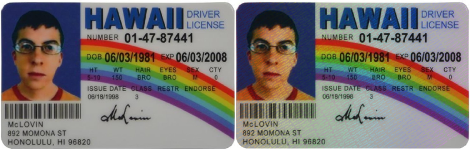

# IDWatermark

A modern library for creating holographic watermarks in images using OffscreenCanvas. Perfect for document protection, digital certificates, or any image requiring a holographic watermark effect.

Spanish: [Read here](docs/es.md).

## Features

- ✨ Customizable holographic effects
- 🎨 Full control over colors and gradients
- 🖼️ Support for multiple image formats
- 🚀 Optimized performance with OffscreenCanvas
- 👷 Web Workers compatible
- 🔄 Asynchronous processing



## Installation

```bash
npm install @videsk/id-watermark
```

## Basic Usage

```javascript
import IDWatermark from '@videsk/id-watermark';

const watermarker = new IDWatermark();

// Process an image
const imageBlob = await fetch('image.jpg').then(r => r.blob());
const watermarkedBlob = await watermarker.addWatermark(imageBlob, 'CONFIDENTIAL');
```

## Configuration

The library accepts the following configuration options:

```javascript
const watermarker = new IDWatermark({
  fontSize: 12,          // Font size
  fontFamily: 'Courier New', // Font family
  opacity: 1,           // Watermark opacity (0-1)
  baseHue: 270,         // Base color (0-360)
  hueStep: 3,           // Color increment between characters
  grayscale: false,     // Convert image to grayscale
  bitmapOptions: {}     // Options for createImageBitmap
});
```

## Understanding Hue Values

The holographic effect is based on HSL (Hue, Saturation, Lightness) color space manipulation. The `hue` parameter determines the base color and its progression:

### baseHue (0-360)

The `baseHue` value represents the initial color in the chromatic circle:

- 0/360: Red
- 60: Yellow
- 120: Green
- 180: Cyan
- 240: Blue
- 270: Violet (default value)
- 300: Magenta

### hueStep

The `hueStep` controls how much the color changes between consecutive characters:

- Low values (1-5): Smooth and gradual changes
- Medium values (5-15): Moderate rainbow effect
- High values (15+): Dramatic color changes

### Combination Examples

```javascript
// Subtle holographic effect in violet tones
const subtleHolographic = new IDWatermark({
  baseHue: 270,
  hueStep: 3
});

// Vibrant rainbow effect
const rainbowEffect = new IDWatermark({
  baseHue: 0,
  hueStep: 15
});

// Blue monochromatic effect
const blueMonochrome = new IDWatermark({
  baseHue: 240,
  hueStep: 1
});
```

## API

### Main Methods

#### `addWatermark(imageInput, watermarkText, encodeOptions)`

Adds a watermark to an image.

```javascript
const result = await watermarker.addWatermark(
  imageBlob,
  'CONFIDENTIAL',
  { type: 'image/jpeg', quality: 0.9 }
);
```

##### Parameters
- `imageInput`: File | Blob | ImageData | ImageBitmap | OffscreenCanvas | VideoFrame | HTMLImageElement
- `watermarkText`: string
- `encodeOptions`: Object (optional)
  - `type`: string (e.g., 'image/jpeg', 'image/png')
  - `quality`: number (0-1)

### Configurable Properties

All properties can be modified at runtime:

```javascript
watermarker.fontSize = 24;
watermarker.opacity = 0.7;
watermarker.baseHue = 180;
```

## Web Workers Usage (Conceptual Example)

```javascript
// main.js
const worker = new Worker('watermark.worker.js', { type: 'module' });

// Send task to worker
worker.postMessage({
  type: 'ADD_WATERMARK',
  payload: {
    image: imageBlob,
    text: 'CONFIDENTIAL',
    options: { baseHue: 270, hueStep: 3 }
  }
}, [imageBlob]);

// Receive result
worker.onmessage = (e) => {
  if (e.data.type === 'WATERMARK_COMPLETE') {
    const watermarkedBlob = e.data.payload;
    // Use the resulting blob
  }
};
```

## Browser Compatibility

- Modern browsers with OffscreenCanvas support
- Chrome 69+
- Firefox 79+
- Edge 79+
- Safari 16.4+

## License

MIT